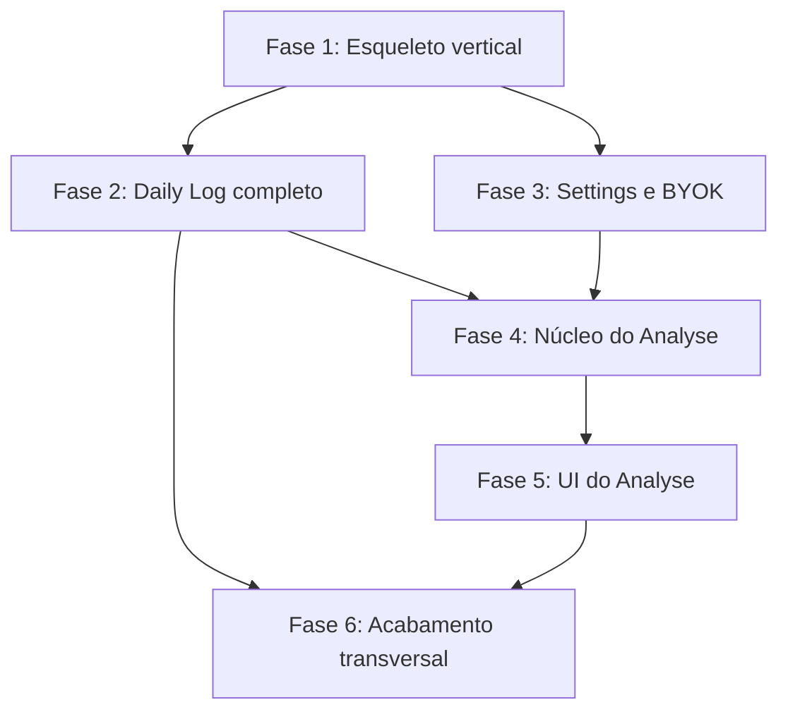

# Roadmap de Implementação (MVP)

Este documento define a **ordem** de implementação do MVP: quais fases existem, o que cada uma depende e quando cada uma está pronta. Ele não substitui `docs/mvp.md` (comportamentos) nem `docs/adrs/` (decisões técnicas) e não repete o conteúdo deles.

## Princípio de ordenação

Fatia vertical primeiro, largura depois. A Fase 1 atravessa todas as camadas (UI → use-case → port → adapter → SQLite → UI) com o mínimo possível de funcionalidade; só a partir dela cada camada ganha largura, sempre respeitando as arestas rígidas de dependência.

A alternativa horizontal (todos os ports, depois todos os adapters, depois toda a UI) perde por dois motivos. Ela só entrega algo observável no último dia, e esconde erro de integração entre camadas até o fim, quando corrigir custa mais.

## Fases

### Fase 1 — Esqueleto vertical

- **Entrega:** o app abre, o usuário cria uma entrada e ela persiste entre execuções.
- **Unidades:** workspace (`packages/domain`, `packages/periods`, `server/`, `ui/`, `desktop/` — ver [ADR 0009](adrs/0009-topologia-do-workspace.md)); API Fastify local com driver SQLite; runner de migrations via `user_version` com a tabela `entries`; tipo `Entry`; port `EntryRepository`; `SqliteEntryRepository` (na API) e `InMemoryEntryRepository`; use-cases `createEntry` e `queryEntries`; `Clock`; `HttpEntryRepository` na `ui/`; teste de integração que sobe o `server/` sem Electron; composition root dos dois lados; timeline no Daily Log; shell Electron e AppImage via `electron-builder`. **O editor já existe** — ver `adaptacao-dailly.md`. Ver [ADR 0007](adrs/0007-api-local-e-tempo.md) e [ADR 0008](adrs/0008-electron-como-shell.md).
- **Depende de:** nada.
- **Pronto quando:** ~~um AppImage gerado do zero abre, aceita uma entrada nova e a exibe na timeline após reiniciar o app.~~ **Revisto em 2026-09-16:** o empacotamento (`electron-builder` → AppImage) está **em stand-by** por decisão do autor, então o critério interino é `make desktop` abrir, aceitar uma entrada nova e exibi-la na timeline depois de reiniciar o app. O AppImage volta quando a unidade voltar; nada mais da fase depende dela.

### Fase 2 — Daily Log completo

- **Entrega:** entradas ganham labels, propriedades e edição, e a timeline ganha filtros.
- **Unidades:** tipos `Label`, `PropertyDef`, `EntryFilter`; ports `LabelRepository`; migrations `labels`, `entry_labels`, `property_defs`; use-cases `updateEntry`, `deleteEntry`, CRUD de Label, CRUD de PropertyDef e propriedades ad-hoc; UI de gestão de labels/propriedades e de filtros.
- **Depende de:** Fase 1. Label e propriedade se penduram em uma `Entry` que precisa existir, e o runner de migrations já está estabelecido.
- **Pronto quando:** o usuário cria uma entrada com label e propriedade, edita, apaga, e recupera o subconjunto correto por filtro combinando label e propriedade.

### Fase 3 — Settings e BYOK

- **Entrega:** o usuário escolhe um provider de IA, salva sua chave e o app confirma que ela funciona.
- **Unidades:** port `Summarizer`; registry de providers; `AnthropicSummarizer` e `OpenAiSummarizer`; UI de Settings com entrada e validação de chave; persistência da chave no keychain do OS.
- **Depende de:** Fase 1 (composition root e shell de UI). Não depende da Fase 2, então pode ser desenvolvida em paralelo com ela.
- **Pronto quando:** a chave salva sobrevive ao reinício do app, nunca aparece no SQLite, e a validação distingue chave válida de inválida.

### Fase 4 — Núcleo do Analyse

- **Entrega:** uma análise de período roda ponta a ponta e persiste seu resultado, sem UI própria.
- **Unidades:** tipo `Materialization`; port `MaterializationRepository`; migration `materializations` e adapter; Processor e use-case `runAnalysis`.
- **Depende de:** Fase 2 (o Processor filtra Entries que precisam existir, com labels e propriedades) e Fase 3 (o Processor chama o `Summarizer` do provider configurado).
- **Pronto quando:** um teste de integração dispara `runAnalysis` sobre um período, com Summarizer fake, e a materialização resultante é recuperada do banco.

### Fase 5 — UI do Analyse

- **Entrega:** o usuário dispara uma análise pela interface, acompanha o progresso, lê o resultado e revisita análises anteriores.
- **Unidades:** seletor de período e filtro; gatilho e indicador de progresso; render da materialização; histórico de materializações.
- **Depende de:** Fase 4 (a UI consome `runAnalysis` e o histórico vem do `MaterializationRepository`).
- **Pronto quando:** o usuário gera uma análise a partir de entradas reais do Daily Log e a encontra no histórico depois de reiniciar o app.

### Fase 6 — Acabamento transversal

- **Entrega:** os dois módulos passam a se comportar de forma previsível fora do caminho feliz.
- **Unidades:** estados de loading, error e empty em Daily Log e Analyse; toasts; mensagens de erro de provider e de banco.
- **Depende de:** Fases 2 e 5. Só faz sentido cobrir estados de telas que já existem por inteiro.
- **Pronto quando:** nenhuma tela fica em branco ou travada diante de banco vazio, chave inválida ou falha do provider.

## Grafo de dependências

## Fora do escopo do MVP

- **Backup e restore** (`StorageProvider`). O ADR0005 está em status Proposto e declara explicitamente que não é implementado no MVP.

## Pontos abertos

- ~~**Contrato do `Clock`**~~ — fechado pela [ADR 0007](adrs/0007-api-local-e-tempo.md): devolve um instante em UTC e **não conhece fuso**; a conversão instante → dia mora em `packages/periods`.
- ~~**`StorageProvider` no ADR0001:**~~ **Confirmado em 2026-09-16: fora do MVP**, como o ADR0005 diz. Não entra em nenhum composition root — port sem adapter na raiz é peso morto, e o ADR0005 ainda está em status Proposto.
- **Formalização do `Processor`:** descrito apenas narrativamente no ADR0001, sem interface. Decidir antes da Fase 4 se é port formal ou convenção de use-case.
- **Ordem interna do Daily Log:** nenhum documento fixa prioridade entre labels, propriedades e filtros. Decidir na decomposição da Fase 2; é escolha de decomposição, não imposição arquitetural.
- ~~**Framework do renderer:**~~ **Fechado pela [ADR 0010](adrs/0010-vue-no-renderer.md):** Vue, com o whiteboard como ilha vanilla. A timeline da Fase 1 já nasce em Vue.
- ~~**Normalização vs. `updated_at`:**~~ **Fechado:** normalizar na criação (`adaptacao-dailly.md` §3).
